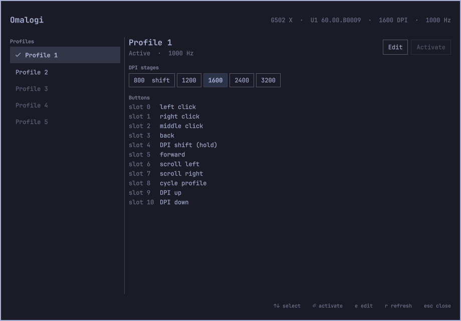
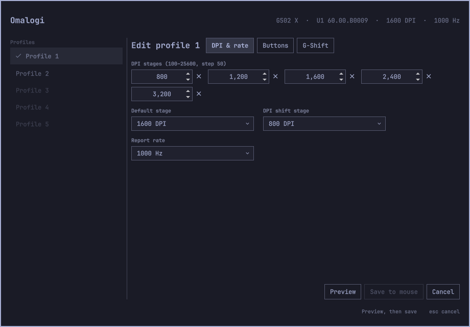
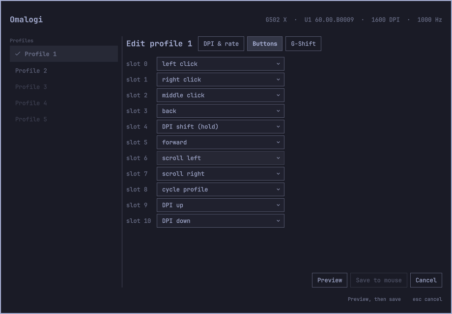

# Omalogi

Configure Logitech G-series mice on [Omarchy](https://omarchy.org): onboard profiles,
DPI stages, report rate and button bindings, automatic profile switching per app and
per monitor, and an overlay and bar indicator that follow your Omarchy theme.

Omalogi talks to the mouse over HID++ 2.0, writes only what you change, backs up the
mouse's profile memory before every write, and reads every write back to verify it.



## Supported devices

| Device | USB id | Status |
|---|---|---|
| Logitech G502 X (wired) | 046d:c099 | Tested on real hardware (firmware U1 60.00.B0009) |

Other G-series mice are not supported yet. Onboard profile layouts differ between
models, and Omalogi only decodes and writes layouts that were verified on a real
device (see [CONTRIBUTING.md](CONTRIBUTING.md) to add one).

## Features

- **Device info**: firmware, current DPI and sensor range, report rates, onboard mode.
- **Profiles**: list the onboard profiles with DPI stages and both button tables
  (normal and G-Shift), and switch the active profile.
- **Editing**: DPI stages, default and DPI-shift stage, report rate, button and G-Shift
  bindings (mouse buttons, keys with modifiers, media keys, DPI and profile actions).
- **Backup and restore** of all profile memory.
- **Automatic switching**: `omalogi daemon` watches Hyprland focus and activates the
  profile your rules pick for the focused app or monitor.
- **Omarchy shell plugin**: an overlay to switch and edit profiles (DPI stages, report
  rate, button and G-Shift bindings, with a preview before every write) and a bar
  indicator showing the active profile, both themed by Omarchy.
- **JSON output** for every command, for scripts and Hyprland bindings.

## Safety

Writing onboard memory is the risky part of any mouse tool. Omalogi:

- saves a backup of all profile memory to a new file before every write
  (`$XDG_STATE_HOME/omalogi/backups/`), never overwriting an older backup;
- patches only the bytes an edit changes in the profile it read from the mouse and
  recomputes the checksum, so data it does not decode is preserved;
- validates every value against what the mouse reports (DPI list, report rates,
  real button slots) and refuses anything else with a reason;
- reads each write back and compares it; on a mismatch it writes the previous
  contents back and tells you whether that worked;
- never writes the factory profiles, and never flashes firmware;
- keeps its daemon off the device while a write is in progress.

Every command that writes has a `--dry-run` that shows the exact change without writing.
Hardware test results are logged in [docs/hardware-tests.md](docs/hardware-tests.md).

## Install from source

Requirements: Omarchy 4 (Hyprland, omarchy-shell), a Rust toolchain (1.98 or newer).

```sh
git clone https://github.com/elberacasa/omalogi
cd omalogi
cargo build --release
install -Dm755 target/release/omalogi ~/.local/bin/omalogi
```

**Device access.** Install the udev rule, which gives your login session access to the
mouse's HID++ interface only, then replug the mouse:

```sh
sudo install -Dm644 packaging/udev/70-omalogi.rules /usr/lib/udev/rules.d/70-omalogi.rules
sudo udevadm control --reload-rules
```

**Shell plugin.** Omarchy loads third-party plugins from `~/.config/omarchy/plugins`:

```sh
mkdir -p ~/.config/omarchy/plugins/io.github.elberacasa.omalogi
cp -r manifest.json plugin ~/.config/omarchy/plugins/io.github.elberacasa.omalogi/
omarchy-shell shell rescanPlugins
omarchy bar put io.github.elberacasa.omalogi --section right
```

**Automatic switching** (optional):

```sh
install -Dm644 packaging/systemd/omalogi.service ~/.config/systemd/user/omalogi.service
sed -i 's|/usr/bin/omalogi|%h/.local/bin/omalogi|' ~/.config/systemd/user/omalogi.service
systemctl --user daemon-reload
systemctl --user enable --now omalogi.service
```

## Usage

```sh
omalogi info                       # device, firmware, DPI, report rate, mode
omalogi profiles                   # profiles, DPI stages, bindings
omalogi profiles activate 2        # switch the active profile
omalogi backup                     # save all profile memory to a file
omalogi restore FILE --dry-run     # see what restoring would write
```

Edit a profile, preview first:

```sh
omalogi profiles edit 1 --dpi 400,800,1600,3200 --default-dpi 800 --dry-run
omalogi profiles edit 1 --rate 500
omalogi profiles edit 2 --button 6=key:ctrl+t --gshift 11=media:mute
```

Button actions: `left`, `right`, `middle`, `back`, `forward`, `button:N`, `dpi-up`,
`dpi-down`, `dpi-cycle`, `dpi-default`, `dpi-shift`, `gshift`, `profile-next`,
`profile-previous`, `profile-cycle`, `scroll-left`, `scroll-right`, `scroll-up`,
`scroll-down`, `key:<combo>` (e.g. `key:ctrl+shift+t`), `media:<name>` (`volume-up`,
`volume-down`, `mute`, `play-pause`, `next-track`, `previous-track`), `disabled`.
Slot numbers are the ones `omalogi profiles` lists.

When stages change, the default and DPI-shift stages keep their DPI values; if a value
is removed you are asked to pick one with `--default-dpi` or `--shift-dpi`. A change to
a profile takes effect the next time that profile is selected.

Add `--json` to any command for machine-readable output.

### Overlay

Open it from the bar indicator or with:

```sh
omarchy-shell shell toggle io.github.elberacasa.omalogi '{}'
```

`↑`/`↓` or `j`/`k` select a profile, `Enter` activates it, `e` edits it, `r` refreshes,
`Esc` closes.

The editor has tabs for DPI and report rate, buttons, and G-Shift buttons. **Preview**
runs the same `--dry-run` as the CLI and shows the exact change; **Save to mouse** only
unlocks after a successful preview of the current edit, asks for confirmation, then does
the backed-up, verified write. `Esc` cancels an edit.

| DPI and report rate | Buttons |
| --- | --- |
|  |  |

To open on a profile, or straight into its editor (handy for a Hyprland binding):

```sh
omarchy-shell shell toggle io.github.elberacasa.omalogi '{"profile":2,"edit":true,"tab":"buttons"}'
```

`tab` is `dpi`, `buttons` or `gshift`.

### Automatic switching

Rules live in `~/.config/omalogi/config.toml`. The first matching rule wins; a rule may
match an app (Hyprland window class, case-insensitive), a monitor (Hyprland monitor
name), or both:

```toml
# Profile to use when no rule matches. Leave it out to keep the current profile.
default_profile = 2

[[rule]]
app = "cs2"
profile = 1

[[rule]]
monitor = "HDMI-A-1"
profile = 1
```

Find window classes with `hyprctl activewindow` and monitor names with `hyprctl monitors`.
The daemon picks up saved changes within a few seconds; a profile you choose on the mouse
stays active until focus changes. Its log: `journalctl --user -u omalogi`.

## Troubleshooting

| Problem | Fix |
|---|---|
| `permission denied opening /dev/hidrawN` | Install the udev rule above and replug the mouse. For one session: `sudo setfacl -m u:$USER:rw /dev/hidrawN`. |
| `no supported Logitech device found` | Connect the G502 X over USB. Wireless receivers are not supported yet. |
| Overlay or indicator missing after an update | `omarchy-shell shell rescanPlugins`; if a new plugin file was added, restart the shell. |
| Indicator shows only the mouse icon | The daemon is not running: `systemctl --user status omalogi`. |
| An edit went wrong | `omalogi restore ~/.local/state/omalogi/backups/<file>` with the backup saved before it. |

## With OpenLogi

Omalogi uses the HID++ implementation from [OpenLogi](https://github.com/AprilNEA/OpenLogi)
(`openlogi-hidpp`) and runs alongside OpenLogi's agent: each process uses its own HID++
software id, so replies never cross. OpenLogi handles host-side features for many
Logitech devices; Omalogi adds the G-series onboard profile support, which OpenLogi does
not have yet, and the Omarchy integration.

## Uninstall

```sh
systemctl --user disable --now omalogi.service
rm ~/.config/systemd/user/omalogi.service
omarchy plugin disable io.github.elberacasa.omalogi
rm -r ~/.config/omarchy/plugins/io.github.elberacasa.omalogi
rm ~/.local/bin/omalogi
sudo rm /usr/lib/udev/rules.d/70-omalogi.rules && sudo udevadm control --reload-rules
```

Backups in `~/.local/state/omalogi/backups/` and rules in `~/.config/omalogi/` are kept;
remove them if you no longer need them. Nothing is changed on the mouse by uninstalling.

## Credits

- [libratbag](https://github.com/libratbag/libratbag) (MIT): onboard profile layout,
  button encodings and write sequence this project follows.
- [Solaar](https://github.com/pwr-Solaar/Solaar) (GPL-2.0): HID++ feature documentation
  and device dumps used to cross-check findings. No Solaar code is used.
- [OpenLogi](https://github.com/AprilNEA/OpenLogi): the `openlogi-hidpp` crate (0BSD).
- [Omarchy](https://omarchy.org) and [Quickshell](https://quickshell.org): the shell and
  theming the plugin is built on.

Not affiliated with Logitech. Logitech, G502 and G HUB are trademarks of Logitech.

## License

MIT OR Apache-2.0, at your option. See [LICENSE-MIT](LICENSE-MIT) and
[LICENSE-APACHE](LICENSE-APACHE).
